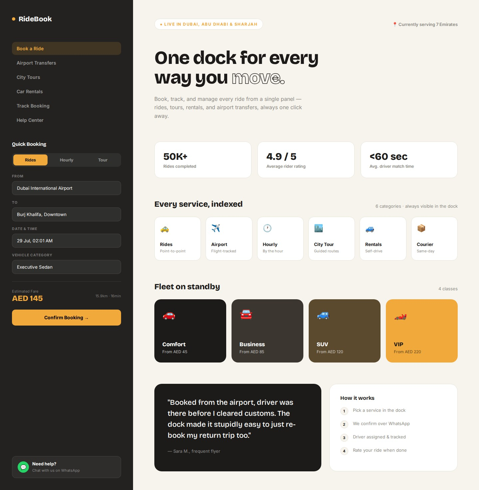
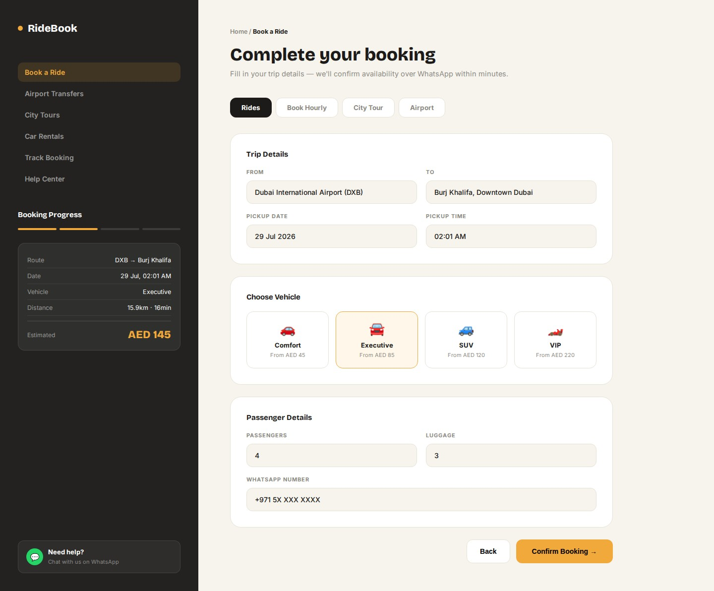
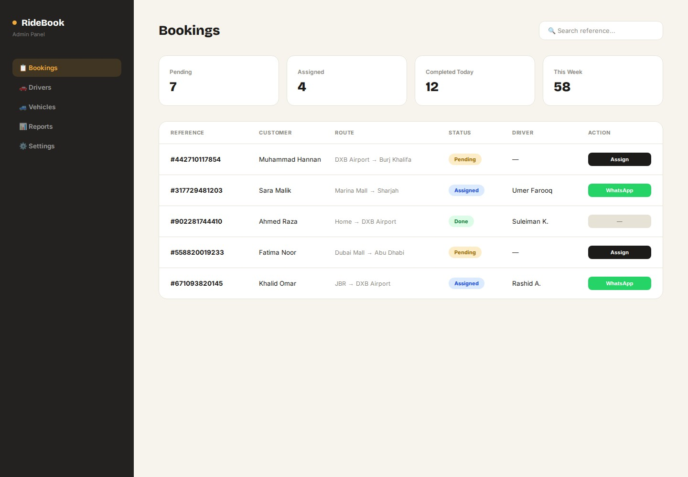
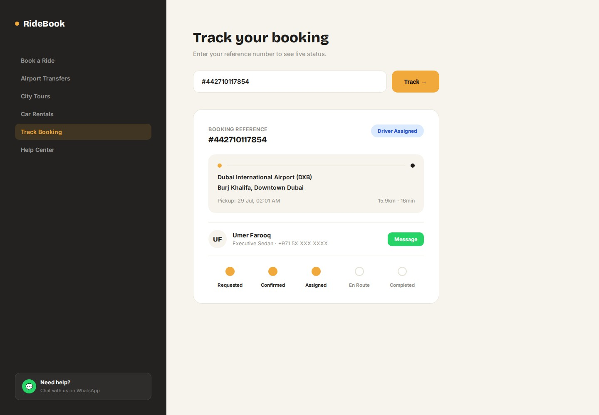

# Ride Booking Platform
## Project Scope & Technical Plan — Revision 2

Prepared by Muhammad Hannan · Revised 4 August 2026
*(Revision 1: 29 July 2026)*

---

## Revision Summary — What Changed in This Version

Revision 1 scoped a Next.js + FastAPI stack running as Docker containers on a self-managed Hostinger VPS. Revision 2 changes the delivery architecture and hosting, for the reasons given below. **Scope, features, phases, timeline, and design direction are unchanged.**

| # | Change | Reason |
|---|---|---|
| 1 | Backend moves from **FastAPI (Python) → Next.js route handlers** | Two runtimes were forcing a larger, self-managed server. One runtime removes a container, a deploy target, and the cross-service auth plumbing — with no loss of capability for a CRUD booking app. |
| 2 | Database moves from **self-hosted PostgreSQL → MySQL** (included with hosting) | Removes a second vendor and the network hop. MySQL's `JSON` and `ENUM` types map cleanly onto the Section 5 schema — no modelling loss. |
| 3 | Hosting moves from **self-managed VPS → Hostinger Business (managed)** | See Section 12. The deciding factor is maintenance liability, not cost. |
| 4 | **Docker / Nginx / Certbot removed** from the production stack | Managed hosting handles process supervision and SSL. Docker remains in use for local development only. |
| 5 | Distance API changed to **Google Routes API** | Distance Matrix is Google's legacy product and is on a deprecation path. |
| 6 | **Reference codes lengthened and randomised** | Security fix — see Section 5.1. |
| 7 | New **Section 17 — Recommendations to the Client** | Operational and commercial advice that sits outside the build itself. |

---

## 1. Project Overview

This document scopes a chauffeur/ride-booking web platform for a client, inspired by the reference site C2C Rides (Dubai). The goal is a lean, buildable MVP that captures the core booking experience without requiring live GPS dispatch, a driver app, or payment gateway integration on day one.

The plan is based on direct analysis of the reference platform's real customer flow (booking confirmation emails and WhatsApp interaction observed first-hand), not just its marketing pages.

---

## 2. How the Reference Platform (C2C Rides) Actually Works

Testing the live site revealed a two-stage confirmation process — the booking is not instantly confirmed on submission:

- Customer submits a booking request through the website (route, date/time, vehicle category, passenger/luggage count).
- An automated transactional email is sent immediately: "Booking Request Received", including a reference number, route summary, distance/duration estimate, and requested date/time.
- A human admin follows up manually over WhatsApp Business (regular app, not the WhatsApp Cloud API) to confirm details and coordinate.
- The admin manually assigns a driver off-platform (phone call / WhatsApp) — there is no evidence of automated dispatch.
- Once confirmed, a second "Booking Confirmed" message/email is sent with the final reference details and a link to a public tracking page.
- The site's "Live Chat" button is a plain WhatsApp click-to-chat link (`api.whatsapp.com/send`), not an API integration — free to replicate, no approval process needed.

**Conclusion:** the sophisticated part of this business is manual, human coordination. The software's job is to make that coordination fast and organized — not to replace it with automation the client doesn't need yet.

---

## 3. Proposed Booking Flow (What We Will Build)

| Step | Actor | What Happens |
|---|---|---|
| 1. Submit booking | Customer | Fills booking form on website (ride / hourly / airport / city tour) |
| 2. Auto-confirmation | System | Reference code generated; instant email sent with booking summary |
| 3. Admin review | Admin | Sees new request in dashboard; contacts customer via WhatsApp deep link |
| 4. Driver assignment | Admin | Manually contacts a driver (phone/WhatsApp); marks booking "assigned" in dashboard with driver name/number |
| 5. Status updates | Admin | Updates status: en route → completed (or cancelled) |
| 6. Tracking | Customer | Enters reference code on a public tracking page to see current status + driver info once assigned |

---

## 4. Feature Scope by Phase

### Phase 1 — MVP (Feasibility Build)

- Public booking form: Ride / Hourly / City Tour / Airport tabs
- Fields: from/to (or duration for hourly), date/time, vehicle category, passenger & luggage count, WhatsApp number, flight number (airport only)
- Auto-calculated distance/duration via Google Routes API (shown to customer + admin)
- Reference code generation + instant confirmation email
- Admin dashboard: list of bookings, filter by status/date, one-click status updates
- Manual driver assignment: dropdown of saved drivers, attaches name + WhatsApp number to booking
- WhatsApp deep-links (`wa.me`) prefilled with booking reference — for both customer-to-admin and admin-to-driver contact
- Public "Track your booking" page (lookup by reference code)
- Static content pages: Home, Services, About, FAQ, Contact

### Phase 2 — Once Validated

- Online payments (Stripe — see Section 16)
- Customer accounts + booking history
- Driver-facing portal (accept/update ride status without relying on admin relay)
- Multi-currency support
- Corporate / travel-agency account types
- Courier service module
- Customer review collection

### Phase 3 — Scale

- Live GPS tracking (Google Maps / Mapbox real-time location)
- Automated driver dispatch / matching logic
- Partner/driver self-onboarding portal
- Dynamic pricing
- SMS / push notifications

---

## 5. Data Model

**Changed in Rev 2:** engine is MySQL rather than PostgreSQL. Types below are given as MySQL equivalents. The logical model is unchanged.

### `bookings`

| Field | Type | Notes |
|---|---|---|
| `id` | CHAR(36) | Primary key (UUID) |
| `reference_code` | VARCHAR(16) | Unique. See 5.1 — format changed in Rev 2 |
| `service_type` | ENUM | ride / hourly / city_tour / airport / courier |
| `pickup_location` | VARCHAR + lat/lng | Address + optional decimal lat/lng columns |
| `dropoff_location` | VARCHAR + lat/lng | Nullable for hourly bookings |
| `stops` | JSON | Optional array of intermediate stops |
| `pickup_datetime` | DATETIME | |
| `duration_hours` | INT | Nullable, hourly bookings only |
| `flight_number` | VARCHAR | Nullable, airport rides only |
| `vehicle_category` | ENUM | Comfort / Business / SUV / VIP / Van |
| `passenger_count` | INT | |
| `luggage_count` | INT | |
| `distance_km` | DECIMAL | Auto-calculated |
| `duration_min` | INT | Auto-calculated |
| `fare_estimate` | DECIMAL | |
| `customer_name` | VARCHAR | |
| `customer_whatsapp` | VARCHAR | |
| `customer_email` | VARCHAR | Nullable |
| `status` | ENUM | requested / confirmed / assigned / en_route / completed / cancelled |
| `created_at` | DATETIME | |

> **Changed in Rev 2:** the status enum previously listed both `requested` and `awaiting_confirmation`. As described in Section 3 these are the same state, so `awaiting_confirmation` has been removed. **Flagged for review** — if the client intends a distinction (e.g. "submitted" vs "admin has seen it"), say so and it goes back in.

### `drivers`

| Field | Type | Notes |
|---|---|---|
| `id` | CHAR(36) | Primary key |
| `name` | VARCHAR | |
| `whatsapp_number` | VARCHAR | |
| `vehicle_assigned` | VARCHAR | Nullable |
| `active` | BOOLEAN | Available for assignment |

### `booking_assignments`

| Field | Type | Notes |
|---|---|---|
| `booking_id` | CHAR(36) | FK → bookings |
| `driver_id` | CHAR(36) | FK → drivers |
| `assigned_at` | DATETIME | |
| `notes` | TEXT | e.g. "confirmed via WhatsApp at 3:40pm" |

### 5.1 Reference Code Format — Security Change (New in Rev 2)

Revision 1 used a short sequential example (`C2C-4821`). Because the public tracking page (Section 9) is unauthenticated and returns the customer's name, WhatsApp number, pickup address and travel time, a four-digit sequential code means the entire customer database can be enumerated by trying codes in order.

**Revised format:** an 8-character random code from a non-ambiguous alphabet (e.g. `C2C-7K4M2XQP`), with a uniqueness constraint and retry-on-collision. Rate limiting on the tracking lookup endpoint.

This costs nothing to implement now and cannot be retrofitted once codes are printed in customer emails. Recommended regardless of budget.

---

## 6. Tech Stack (Revised)

| Layer | Choice |
|---|---|
| **Frontend + Backend** | **Next.js (App Router) + TypeScript + Tailwind.** UI and API in one application; API implemented as route handlers. Replaces the separate FastAPI service. |
| **Database** | **MySQL**, included with the Hostinger Business plan. Accessed via **Drizzle ORM** with versioned migrations. |
| **Auth (admin)** | Session-based auth implemented in Next.js middleware; password hashed with argon2. Single admin account seeded from environment variables. |
| **Distance / fare calc** | **Google Routes API** (`computeRouteMatrix`). Called server-side only; results cached per rounded origin/destination pair to limit billable elements. |
| **Transactional email** | Resend (HTTPS API) |
| **Customer contact** | WhatsApp click-to-chat (`wa.me` links) — no API cost |
| **Hosting** | **Hostinger Business plan** (managed Node.js hosting), 12-month term |
| **SSL** | Included and managed by host |
| **Deployment** | Hostinger's built-in GitHub integration — build on push to `main` |
| **Local development** | Docker Compose (MySQL only) + `next dev` |
| **Pre-launch staging** | Vercel free tier + free hosted MySQL (Aiven or TiDB Cloud serverless) — see Section 12.4 |

**Removed from Rev 1:** FastAPI, self-hosted PostgreSQL, Docker in production, Nginx reverse proxy, Certbot, VPS provisioning and maintenance.

**Pricing model note:** fares are computed from a `vehicle_category → base + per_km + per_min + minimum` table stored in the database, not hardcoded. This is the value most likely to change after client feedback and must be editable without a redeploy.

---

## 7. Cost & API Breakdown (Revised)

### 7.1 Service-by-Service

| Service | Used For | Free Tier | Cost Beyond Free Tier |
|---|---|---|---|
| WhatsApp (click-to-chat) | Customer ↔ admin ↔ driver contact | Fully free — no API, no approval | N/A |
| Google Routes API | Distance/duration/fare calc | Monthly free allowance, covers MVP volume | Per-element billing after allowance |
| Resend | Booking request & confirmation emails | 3,000 emails/month, 100/day, 1 domain | $20/month (Pro) — not needed at MVP volume |
| Hostinger Business | Node.js app + MySQL + SSL + daily backups | N/A — flat fee | See 7.2 |
| Domain name | e.g. yourbrand.com | Often bundled free for year 1 | ~$10–$15/year thereafter |
| Vercel + Aiven (staging only) | Pre-launch demo | Free tiers | Temporary; removed at launch |

### 7.2 Total Estimated Cost

| Scenario | Cost | Notes |
|---|---|---|
| Development phase | $0 | Local only |
| Pre-launch demo | $0 | Vercel free tier + free hosted MySQL |
| **Phase 1 live launch (Year 1)** | **~Rs 799/month, 12-month term** | Hostinger Business promotional rate. Roughly $34/year equivalent. |
| Year 2+ (renewal) | ~Rs 2,299/month | Roughly $98/year equivalent |
| Plus one-time / annual | $0–$15/year | Domain (often bundled free year 1) |

> Pricing observed in PKR on the client-side account in August 2026; USD equivalents are approximate and FX-dependent. Displayed prices typically exclude local tax. Promotional rates change — the **renewal** figure is the durable number to plan around.

---

## 8. Admin Dashboard Requirements

- Booking list with filters (status, date range, service type)
- Booking detail view: full trip info, customer contact, distance/fare
- One-click "Message customer on WhatsApp" (prefilled with reference code)
- Driver assignment: select from active drivers, one-click "Message driver on WhatsApp" (prefilled with pickup/dropoff/time)
- Status update buttons: confirmed → assigned → en route → completed / cancelled
- Simple stats widget: bookings today, pending count, completed this week

---

## 9. Customer-Facing Requirements

- Booking form with tabs: Rides / Book Hourly / City Tour
- Instant reference code + confirmation email on submit
- Public tracking page: enter reference code → see current status (and driver info once assigned)
- WhatsApp "Need help?" button site-wide, prefilled with reference code when on a booking-related page
- Static marketing pages: services, fleet categories, about, FAQ, contact

> **Rev 2 note:** the tracking page is unauthenticated and returns customer PII. Mitigations in Section 5.1 (long random codes, rate limiting) apply here.

---

## 10. Estimated Timeline (Phase 1 MVP)

| Week | Focus |
|---|---|
| Week 1 | Data model + migrations, API route handlers (bookings, drivers), booking form UI, Routes API distance/fare calc |
| Week 2 | Admin dashboard, WhatsApp deep-links, confirmation emails, tracking page, technical SEO, QA + polish |

**Solo build estimate: 1.5–2 weeks** for a fully functional, demoable Phase 1, assuming scope stays as defined.

> **Rev 2 note:** dropping the second runtime and the VPS removes roughly a day of infrastructure work (Docker Compose, Nginx, Certbot, deploy scripting). That margin is absorbed by the expanded Phase 1 page list in Section 14.5 rather than shortening the estimate.
>
> **Not included in this estimate:** written copy for the five service pages. If the client is not supplying it, that is additional time.

---

## 11. Open Questions — Status

### 11.1 Resolved

- **Payment gateway at launch?** — No. Phase 1 is cash/manual. Phase 2 gateway decided as Stripe (Section 16).
- **Visual design direction** — Split Dock selected after comparing 4 directions (Section 13).
- **Hosting approach** — *Revised in Rev 2:* Hostinger **Business** managed hosting, replacing the Rev 1 self-managed VPS decision. See Section 12.
- **Backend language** — *New in Rev 2:* Next.js route handlers, replacing FastAPI. Single runtime.
- **Database engine** — *New in Rev 2:* MySQL, included with hosting, replacing self-hosted PostgreSQL.
- **Driver network** — Client already has drivers. No self-onboarding portal in Phase 1; existing drivers are entered into the driver list. Self-onboarding remains Phase 3.
- **Launch cities** — UAE cities with tourist relevance. Informs city-tour page priority (Section 14.2).

### 11.2 Still Open — Needs a Client Answer

- **Business entity structure** — Stripe requires a UAE sole establishment, branch, or free zone establishment (Section 16.2). Determines whether Stripe is usable or PayTabs is needed. *Highest priority: this also gates the legal name, domain, and merchant account, and has the longest lead time.*
- **Final business name** — Not yet finalised or domain-checked. Blocks branding, domain registration, and the merchant account.
- **Domain registration** — Does the client have a preferred registrar, or should this be set up as part of the project? (Hostinger bundles a free year-1 domain.)
- **Final Phase 1 page list sign-off** — The 10–12 page recommendation in Section 14.5 needs explicit approval, as it exceeds the original 4-screen plan.
- **Status enum** — Confirm whether `awaiting_confirmation` is genuinely distinct from `requested` (Section 5).

---

## 12. Hosting Decision (Revised)

Revision 1 selected a self-managed Hostinger VPS on cost grounds. Revision 2 reverses that. The cost analysis in Rev 1 was sound; the omission was **who maintains the server after the build ends**.

### 12.1 Why Not the VPS

A self-managed VPS means someone must apply security patches, monitor uptime, renew certificates, and recover from failure — indefinitely. The client is not technical. A server running unpatched Linux and holding customers' names, phone numbers and pickup addresses is a liability the client would be carrying without knowing it.

The business itself is manual, human coordination (Section 2). Client attention belongs on operations, not on server administration.

### 12.2 Option Comparison

| | Managed Stack (Rev 1 "Option A") | Self-Managed VPS (Rev 1 "Option B") | **Hostinger Business (Rev 2)** |
|---|---|---|---|
| Year 1 | ~$334–$639 | ~$84–$105 | **~$34 equivalent** |
| Year 2+ | ~$334–$639 | ~$144–$192 | **~$98 equivalent** |
| Upfront commitment | Monthly | 24-month lump | **12-month term** |
| Server maintenance | None | Ongoing, self-managed | **None** |
| SSL | Managed | Self-configured | **Managed** |
| Backups | Managed | Self-configured | **Daily, included** |
| Scaling | Automatic | Manual | Plan upgrade |
| Docker / background workers | Yes | Yes | **No** |

### 12.3 What This Trades Away

Managed shared hosting cannot run Docker, background workers, cron containers, or any process outside the Node app. Nothing in Phase 1 or Phase 2 requires them. If Phase 3 introduces automated dispatch or scheduled jobs, a move to a VPS or a managed platform will be required — the application code does not change, only where it runs.

**Not recommended:** the Hostinger *Cloud* tiers (from ~Rs 2,099/month, renewing ~Rs 5,399/month). They cost more than the managed stack rejected in Rev 1 and buy capacity — 200,000+ monthly visits — that a pre-launch booking MVP will not approach.

### 12.4 Pre-Launch Staging (New)

The business name is not final, so the production domain and hosting cannot be purchased yet. Until then:

- Deploy to **Vercel free tier** on a `*.vercel.app` subdomain
- Use a **free hosted MySQL** (Aiven or TiDB Cloud serverless) — same engine as production, so migration is `mysqldump` + import
- At launch: dump/restore, change `DATABASE_URL`, point the domain (~10 minutes)

Two constraints: Vercel's Hobby tier prohibits commercial use, so this is strictly a pre-launch demo; and the staging app must not connect to Hostinger's MySQL, which restricts remote access by IP whitelist while Vercel's egress IPs are dynamic.

---

## 13. UI Mockups — Final Approved Design (Split Dock)

*Unchanged from Revision 1.*

After exploring four design directions (Split Dock, Aurora Bento, Heritage Editorial, App Showcase), **Split Dock** was selected. Its defining feature: a persistent left-hand panel holds the entire booking form (public pages) or admin navigation (admin dashboard), staying visible while content scrolls independently on the right.

### 13.1 Homepage

Persistent booking dock on the left (quick booking form, nav links, WhatsApp card) with marketing content — stats, service index, fleet, testimonial — scrolling on the right.

### 13.2 Booking Form

Full multi-step booking flow with a live trip summary and running fare total in the dock, so the customer always sees their booking state while filling in details.

### 13.3 Admin Dashboard

The same dock shell switches to admin navigation (Bookings, Drivers, Vehicles, Reports, Settings) on the left, with the booking list, stats, and one-click driver assignment on the right.

### 13.4 Public Tracking Page

Customer enters their reference code to see route, pickup time, assigned driver details, a direct WhatsApp contact button, and a visual status timeline (requested → confirmed → assigned → en route → completed).

---

## 14. Full Site Map — Reference Platform & Phase Planning

*Unchanged from Revision 1.* A scan of c2cride.com surfaced ~30 distinct pages — the mature, multi-year version of the business.

### 14.1 Service Pages (10)

| Page | URL | Phase |
|---|---|---|
| Home | `/` | Phase 1 |
| Rides | `/rides` | Phase 1 — SEO landing page |
| Airport Rides | `/airport-rides` | Phase 1 — high search intent |
| City Tour | `/city-tour` | Phase 1 |
| Car Rentals | `/car-rentals` | Phase 1 |
| Courier Service | `/courier-service` | Phase 2 |
| Private Charter | `/private-charter` | Phase 2 |
| Full Day Chauffeur | `/full-day-luxury-chauffeur` | Phase 2 |
| Desert Safari | `/premium-desert-safari` | Phase 2 |
| Rides for Business | `/business-ride` | Phase 2 |

### 14.2 City / Destination Tour Pages (7) — all Phase 2

Ranked by general tourism volume, for discussion — local knowledge of actual customer demand should override this generic ranking.

| Page | URL | Priority |
|---|---|---|
| Dubai Tour | `/dubai-tour` | 1 — highest volume |
| Abu Dhabi Tour | `/abu-dhabi-tour` | 2 — Sheikh Zayed Mosque, Louvre |
| Ras Al Khaimah Tour | `/ras-al-khaimah-tour` | 3 — Jebel Jais, adventure tourism |
| Sharjah Tour | `/sharjah-tour` | 4 — cultural/heritage |
| Fujairah Tour | `/fujairah-tour` | 5 — beach/mountain |
| Ajman Tour | `/ajman-tour` | 6 |
| Umm Al Quwain Tour | `/umm-al-quwain-tour` | 7 |

### 14.3 Help & Legal Pages (8)

| Page | URL | Phase |
|---|---|---|
| About Us | `/about-us` | Phase 1 |
| FAQs | `/faqs` | Phase 1 — reduces WhatsApp support load |
| Contact Us | `/contact-us` | Phase 1 |
| Support | `/support` | Phase 1 — can merge with Contact initially |
| Booking Conditions | `/booking-conditions` | Phase 1 — before accepting real bookings |
| Terms & Conditions | `/terms` | Phase 1 |
| Privacy Policy | `/privacy` | Phase 1 — before collecting customer data |
| Account Deactivation | `/account-reactivation` | Phase 2 |

### 14.4 Business & Account Pages (5)

| Page | URL | Phase |
|---|---|---|
| Travel Agencies | `/travel-agencies` | Phase 2 |
| Corporate | `/corporations` | Phase 2 |
| Holiday Homes | `/holiday-homes` | Phase 3 — separate vertical |
| Become a Partner | `/become-partner` | Phase 2 |
| Login / Signup | `/login` | Phase 2 |

### 14.5 Recommended Phase 1 Page List — 10–12 pages

- **Service pages (5):** Home, Rides, Airport Rides, City Tour, Car Rentals — doubling as SEO landing pages rather than just tabs
- **Booking (2):** Booking Form, Track Booking
- **Trust (3):** About Us, FAQs, Contact Us
- **Legal (3):** Terms & Conditions, Privacy Policy, Booking Conditions
- **Admin (1):** Admin Dashboard — not public-facing

The extra pages are mostly content and reuse the same booking widget and layout components, rather than new systems. **Copy must be supplied or scoped separately** (see Section 10).

---

## 15. SEO Strategy

*Unchanged from Revision 1. Note: Next.js still handles all of this natively — the stack change does not affect any item below.*

### 15.1 Why This Matters Here

Local service searches ("airport transfer Dubai," "chauffeur service UAE") are dominated by Google's Local Pack and Maps results. Roughly a third of local ranking weight comes from Google Business Profile signals alone — meaning SEO here is as much about business-profile setup and reviews as it is about the website's code.

### 15.2 Technical SEO (Built In From Day One)

- Server-side rendering / static generation for all public pages
- Core Web Vitals as a hard requirement — fast LCP, low INP, stable layout
- Mobile-first design and testing
- HTTPS everywhere (included with managed hosting)
- Clean, descriptive URLs (`/airport-rides`, not `/page?id=4`)
- Auto-generated XML sitemap + correct `robots.txt`, submitted to Search Console
- Unique title tags and meta descriptions on every page

### 15.3 Structured Data

- `LocalBusiness` / `TransportationService` schema on the homepage
- `Service` schema on each service page
- `FAQPage` schema on the FAQ page
- `Review` / `AggregateRating` once real reviews exist

### 15.4 Local SEO (Highest-Impact Work)

- Set up and fully complete a **Google Business Profile** — correct primary category ("Airport Shuttle Service" or "Chauffeur Service", not generic), service area, hours, photos
- Keep **NAP** (Name, Address, Phone) perfectly consistent across site, profile, and directories
- Actively collect reviews after each ride — a WhatsApp follow-up is low-effort, high-impact
- List on relevant UAE directories

### 15.5 Content Strategy

- Each service gets a full landing page with real descriptive content, not just the booking widget
- City/destination pages (14.2) are a strong Phase 2 SEO play
- A real FAQ page captures long-tail traffic and reduces repetitive WhatsApp questions

### 15.6 Tracking & Ongoing Work

- Google Search Console and Analytics from launch day
- Track rankings, CTR, indexed page count monthly
- Expect measurable local ranking improvement in 3–6 months, not immediately

**Recommendation:** bake 15.2 and 15.3 into the build. Treat 15.4 as an operational task for whoever runs the business. Treat 15.5 as a deliberate follow-up phase.

---

## 16. Payment Gateway Strategy (Phase 2)

*Unchanged from Revision 1.* Payment is out of scope for Phase 1 — bookings are confirmed manually and paid offline.

### 16.1 What We Found on the Reference Platform

- Initial inspection suggested only "Pay with Card" / "Pay with Cash" with no visible custom checkout.
- Direct inspection of the live checkout resolved this: "Pay with Card" opens a hosted checkout at `checkout.stripe.com` — the reference platform uses **Stripe**.
- The Stripe page displays the merchant as **"C2C FZE LLC"**, confirming a UAE Free Zone Establishment, and proving in practice that a UAE free-zone company can process live AED payments through Stripe.

### 16.2 Stripe & UAE Eligibility

| UAE Business Structure | Stripe Eligible? |
|---|---|
| Sole establishment | Yes |
| Branch of a sole establishment | Yes |
| Free zone establishment (FZE) | Yes — confirmed by Stripe's docs and the reference platform's live checkout |
| Individual with no UAE-registered entity | No — a valid UAE trade license is required |

### 16.3 Gateway Comparison

| | Stripe | PayTabs | Geidea |
|---|---|---|---|
| Cards | Yes | Yes (+ Mada, UnionPay, Maestro) | Yes (+ Mada) |
| Apple Pay | Yes — confirmed live | Yes | Yes |
| Google Pay | Yes | Unconfirmed | Unconfirmed |
| PayPal | Region-limited | Yes | Unconfirmed |
| 1-click repeat checkout | Yes (Link) | No | No |
| Published pricing | Yes — ~2.9% + fixed | Yes — from 2.85% + AED 1, free under AED 20,000/mo | No — sales contact only |
| Developer experience | Best-in-class | Good | Basic |
| Proven UAE precedent | Yes — reference platform | Common regionally | Common regionally |

### 16.4 Recommendation

**Stripe**, subject to the client's entity structure being confirmed as eligible.

- If eligible: integrate **Stripe Checkout** (hosted page) for Card + Apple Pay + Google Pay.
- **Cash on Arrival** remains available in parallel, matching the manual booking flow.
- PayPal is not a priority — the reference platform doesn't offer it and UAE consumers use it far less than card/Apple Pay/Google Pay.
- If Stripe eligibility doesn't fit the final structure, **PayTabs** is the fallback.

---

## 17. Recommendations to the Client (New in Rev 2)

These sit outside the build itself but materially affect cost, risk, and outcome.

**1. Sequence spending behind validation.** Launch on a 12-month hosting term, not a multi-year prepaid plan. If the business works, upgrading is trivial. If it doesn't, the exposure is a few thousand rupees rather than a hundred thousand.

**2. Avoid self-managed infrastructure.** Covered in Section 12.1. The cost saving is real but small, and it is paid for with an ongoing maintenance obligation the client is not positioned to meet.

**3. Every account in the client's name.** Domain, hosting, database, Resend, Google Maps, Google Business Profile — registered to the client's email and card, with the developer added as a collaborator. This is a build being handed over as an asset, not a dependency. Clients are routinely stranded by infrastructure sitting in a former developer's personal account.

**4. Resolve the business registration first.** It is the longest-lead-time item, it is entirely outside the developer's control, and it gates the legal name, the domain, the branding, and the Phase 2 merchant account. Everything else in Section 11.2 has a workaround; this does not.

**5. Start Local SEO now, not at launch.** Google Business Profile setup, category selection, and review collection accrue value with age. Beginning during the build period rather than after it is free and is likely worth more than the entire technical SEO section.

---

*End of Revision 2.*
